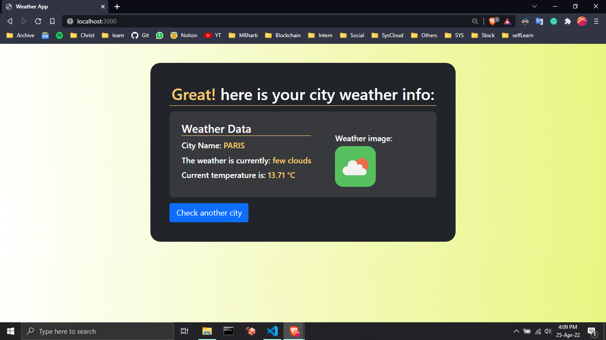
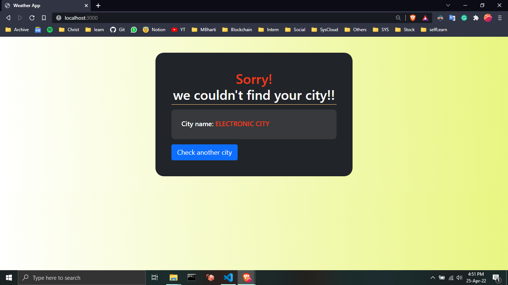
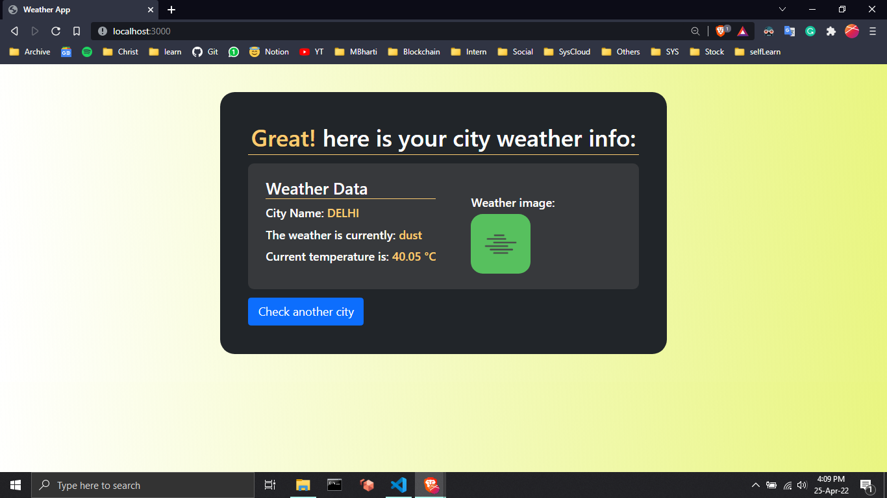
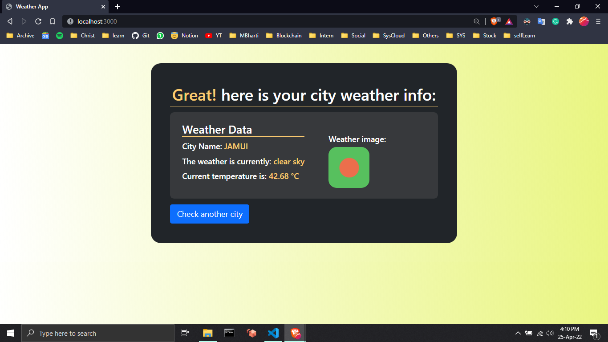
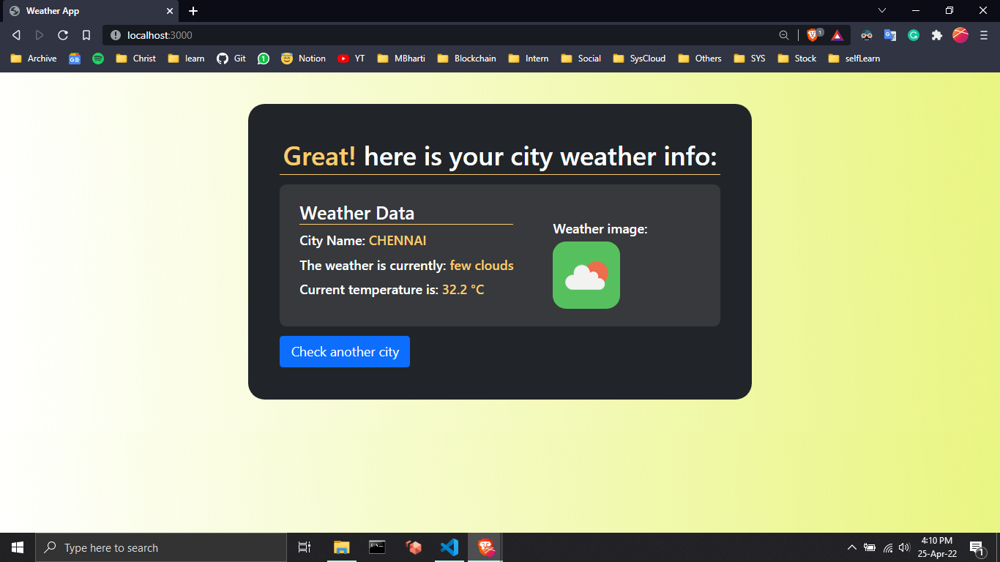
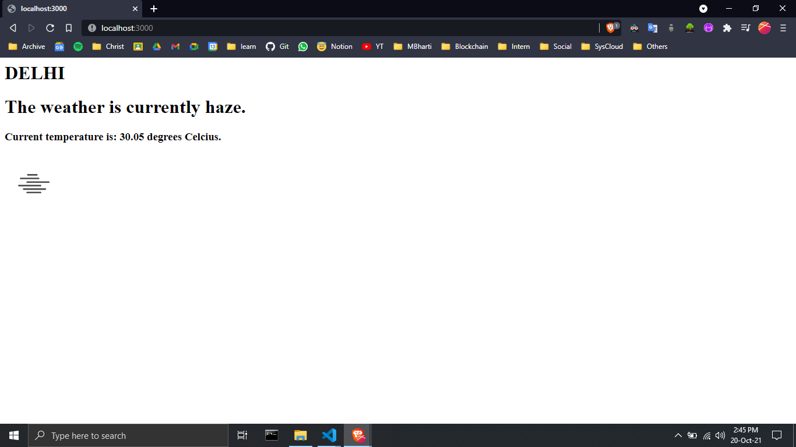

# Weather Check
- Using node.js, OpenWeatherMap API
- Using OpenWeatherMap API, fetched current weather
details of the city entered by the user and display in UI

## Screenshots
"1. City Input"

"2. Weather Info"

"3. City Not Found"

"4. Weather Info3"

"5. Weather Info4"

"6. Weather Info5"

"7. Weather Info Old"
